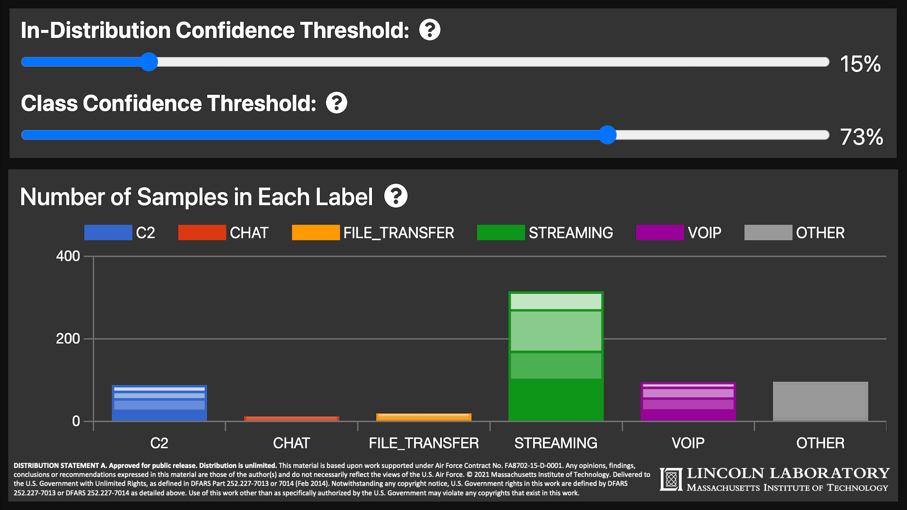

<h1>Interactive, Visual Uncertainty Quantification for Encrypted Network Traffic Situation Awareness</h1>
<div>Harry X. Li, Allan Wollaber</div>
<br/>
<div><i>Presented at <a href="https://vizsec.org/vizsec2021/" target="_blank" rel="noopener noreferrer">VizSec21</a>, Best Poster</i></div>
<br/>

https://harryli0088.github.io/interactive-visual-uncertainty-quantification/

[](static/Interactive_Visual_Uncertainty_Quantification_Poster.pdf)
[](static/Interactive_Visual_Uncertainty_Quantification_Abstract.pdf)



<h2>Distribution Statement</h2>

All the documents including the poster, abstract, videos, and descriptive text have this distribution statement:

<b>DISTRIBUTION STATEMENT A. Approved for public release. Distribution is unlimited.</b> This material is based upon work supported under Air Force Contract No.
FA8702-15-D-0001. Any opinions, findings, conclusions or recommendations expressed in this material are those of the author(s) and do not necessarily reflect the views of
the U.S. Air Force. © 2021 Massachusetts Institute of Technology. Delivered to the U.S. Government with Unlimited Rights, as defined in DFARS Part 252.227-7013 or
7014 (Feb 2014). Notwithstanding any copyright notice, U.S. Government rights in this work are defined by DFARS 252.227-7013 or DFARS 252.227-7014 as detailed
above. Use of this work other than as specifically authorized by the U.S. Government may violate any copyrights that exist in this work.


## Deploying to Github Pages

Adapted from https://github.com/Sh031224/svelte-kit-github-page-example

1. Install ```adapter-static``` and ```gh-pages```
```
npm i -D @sveltejs/adapter-static@next gh-pages
```

2. Updated ```svelte.config.js```
```js
import static_adapter from '@sveltejs/adapter-static';

const config = {
	kit: {
    adapter: static_adapter({
			// default options are shown
			pages: 'build',
			assets: 'build',
			fallback: null
		}),
    paths: {
      base: '/your-repo-name'
    }
	}
};

export default config;
```

3. Add an empty ```.nojekyll``` file in your ```static/``` directory, otherwise GitHub Pages will ignore files with a leading underscore (ie ```_app/```)

4. Add a deploy script to ```package.json```
```json
{
  "scripts": {
    "deploy": "npm run build && npx gh-pages -d build -t true"
  }
}
```

5. Run the deploy script
```
npm run deploy
```